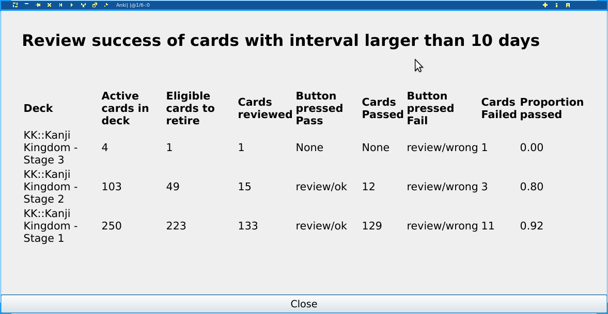

Retirement Interval Analyzer
-------------

This add-on is to be used  in conjunction with the [MIA Retirement Add-on.](https://ankiweb.net/shared/info/1666520655)

It scans the review queue to find cards that are eligible for retirement.
If they have been reviewed, it reports the results of these reviews. See below:

The input to the add-on is the number of days of interval. Any card with a number of days larger than this
will be included in the report.

Author
-----

Daniel M  German <dmg@turingmachine.org>

License
-------

This add on is under the AGPLv3.
